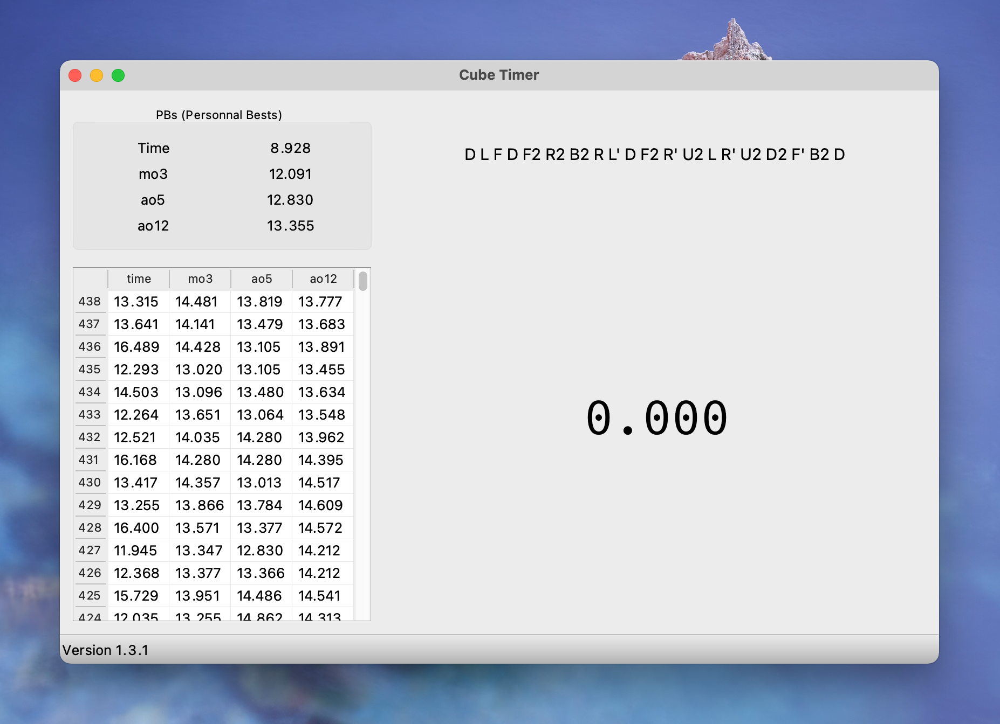
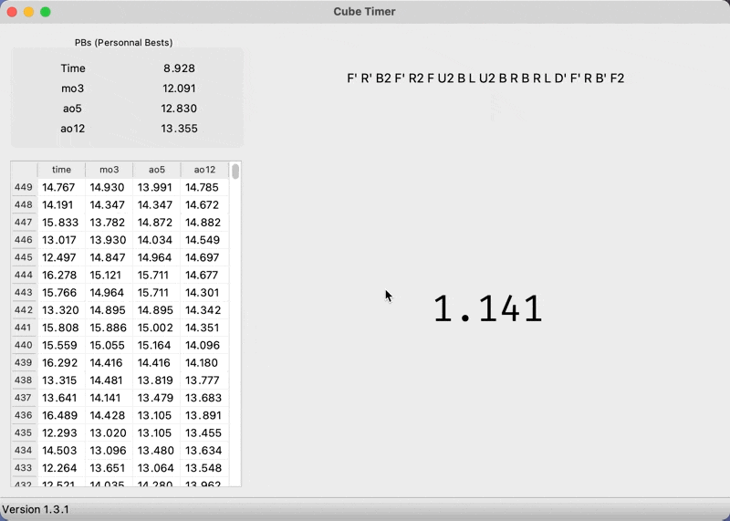
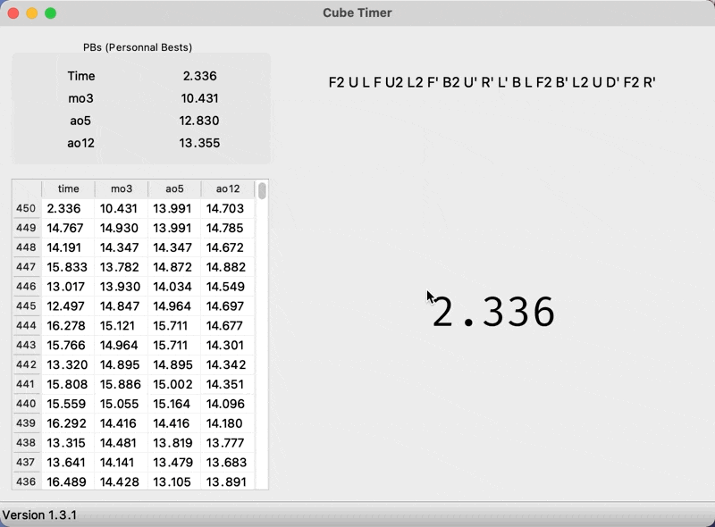

# Cube timer



This is a simple GUI project using Qt to create a cube timer suited to my personal needs.
Concretly this means:
- It is purely intended for macOS users (on other OS's the CMakeLists won't even create the main target 
  ```cube-timer```). The main reason for this is that it uses the ```.app``` bundle particularities such as the ```Resource``` directory to save the preferences and data files. If you find easy to  implement alternatives for other platforms I am open to suggestions and pull-requests.
- The available features will probably never be ground-breaking compared to other timers out there, and I won't develop features I don't find intend to use (even though they may be very popular in the community).\
For example, I won't implement inspection times for 3x3 blind or scrambles for cubes larger that 3x3. I won't develop neither stackmat nor other physical timers integration, nor smart cubes integration.

## Current features :
- Timing at milliseconds precision. One must keep the space bar pressed for 0.3s before launching the timer (customizable).
- 20 moves scramble generation (non customizable) after each attempt.
- Generating new scrambles before launching the timer (if you don't like the current one)
- ao5 and ao12 computed live and saved along with the actual times once the app is closed.
- Saving the data in a custom location instead of the ```default-historic.csv``` file in the Application.
- Settings Panel for auto Save and launching interval
- PBs displayed.
- More informations available with a double click and/or a right click

## Copyright
This project is licenced under the MIT licence (see ```LICENCE``` file).

## Screenshots
### Timing your solves :

### Changing the settings :

### Displaying additional information :

### Deleting times :
